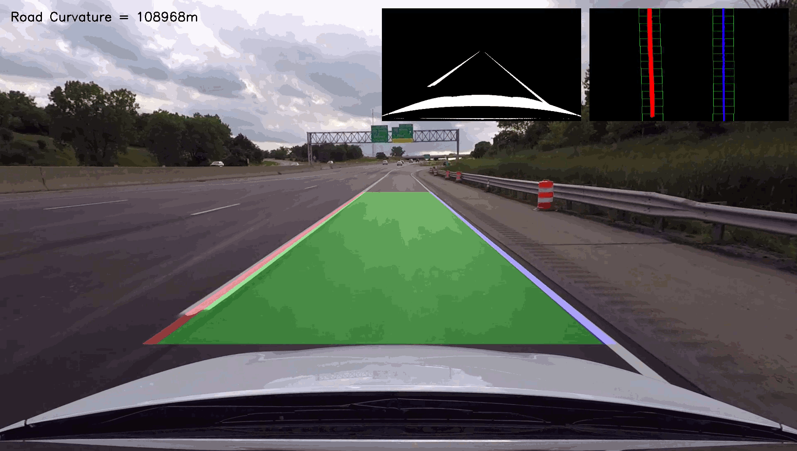
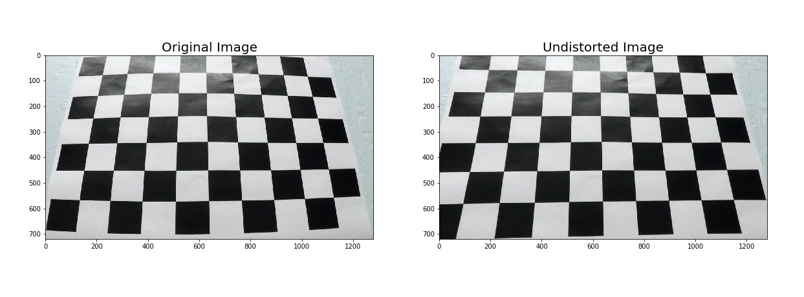
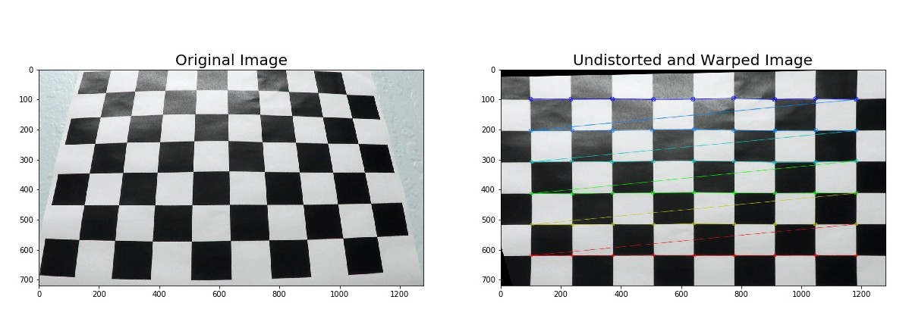
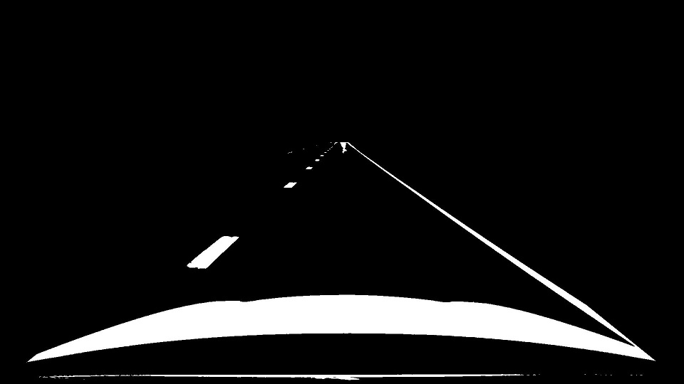
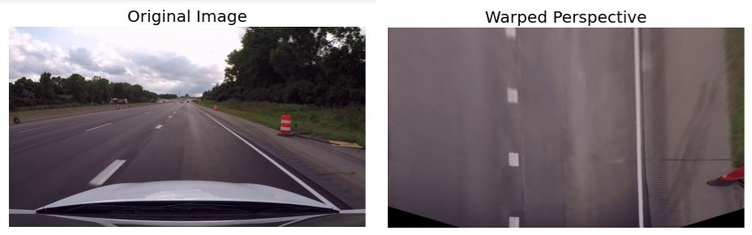
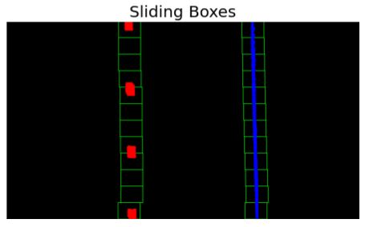
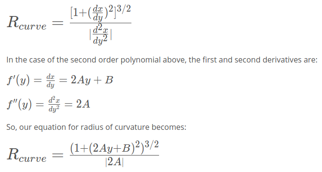
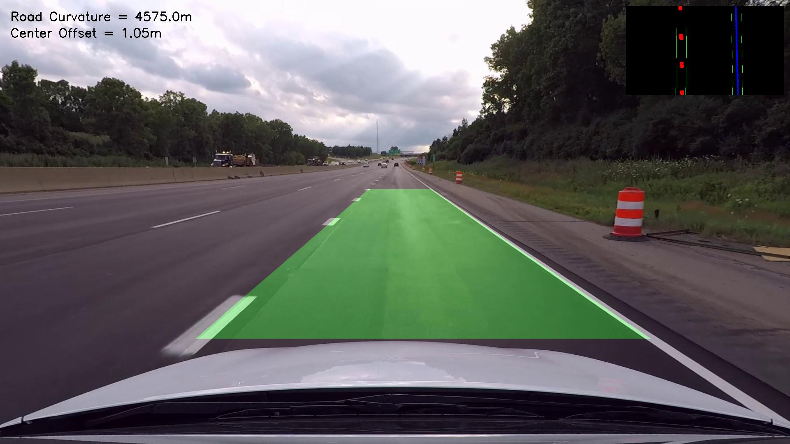

# Advanced Lane Finding using Deep Learning
[](http://www.udacity.com/drive)



The aim of this project is to develop machine learning model to identify lanelines in a highway driving scenario. We will also calculate radius of curvature and center offset of the vehicle.

The steps used for developing this code are -

1. Compensating for lens distortion
2. Developing image processing pipeline
   * Performing distortion correction for images
   * Applying a combination of different image thresholds for identifying lanelines
   * Isolating region of interest and create a binary image
   * Applying perspective transform on the masked image to obtain a bird's eye view of the images
   * Creating histogram to identify highest pixel concentration
   * Use a sliding windows approach to capture the curvature of laneline
   * Calculate the radius of curvature by fitting a 2nd order polynomial to pixel indices
3. Create a .csv file that stores image information along with the polynomial indices
4. Train the machine learning model using Keras with the .csv file as input
5. Create training and validation sets
6. Test the model using different video stream to check the accuracy of the model

---

## Folder Structure Details

| **File Name** | **Details** |
| :--- | :--- |
| [camera_calculations.ipynb](./camera_calculations.ipynb) | Jupyter Notebook containing pipeline followed for camera calibration |
| [pipeline_images.ipynb](./pipeline_images.ipynb) | Jupyter Notebook containing pipeline followed for identifying images using OpenCV functions
| [video_pipeline.ipynb](./video_pipeline.ipynb) | Code to extract and save image data and lane |parameters |
| [train_cnn.ipynb](./train_cnn.ipynb) | File used for training the model |
| [class_lanelines_1.py](./class_lanelines_1.py) | Python file detecting and storing lanelines information |
| [camera_cal](./camera_cal/) and [camera_cal_outputs](./camera_cal_outputs/) | Directories for original chessboard images and undistorted chessboard images |
| [pickle](./pickle/) | Pickle file storing camera calibration matrices for undistorting images |
| [test_images](./test_images/) and [test_images_output](./test_images_output/) | Directories for test images and thresholded output images |
| [model.h5](./model.h5) - containing a trained convolution neural network |
| [data for lane detection](../data_for_lane_detection/) | This directory is one level up of all our notebook and is used to store input video streams, transformed and thresholded images, neural network training data and some other information |


### Libraries required for running this project -

1. [OpenCV](https://docs.opencv.org/4.4.0/)
2. [NumPy](https://numpy.org/install/)
3. [Natsort](https://github.com/miracle2k/python-glob2)
4. [Glob](https://docs.python.org/3/library/glob.html)
5. [Progressbar](https://progressbar-2.readthedocs.io/en/latest/#install) (for status visualization)

---

## Problem Statement

<span style="font-family:Calibri; font-size:1.5em;">**Using Deep Learning and Convolutional Neural Networks to develop a robust algorithm to identify and draw lanelines in a given video stream.**</span>

The goals / steps of this project are the following:

* Compute the camera calibration matrix and distortion coefficients given a set of chessboard images.
* Apply a distortion correction to raw images.
* Use color transforms, gradients, etc., to create a thresholded binary image.
* Apply a perspective transform to rectify binary image ("birds-eye view").
* Detect lane pixels and fit to find the lane boundary.
* Determine the curvature of the lane and vehicle position with respect to center.
* Warp the detected lane boundaries back onto the original image.
* Output visual display of the lane boundaries and numerical estimation of lane curvature and vehicle position.

The images for camera calibration are stored in the folder [camera_cal]('./camera_cal/'). The images in [test_images]('./test_images/') are for testing the pipeline on single frames.

---
## Image Pipeline

### Computing the Camera Calibration Matrix

**1. Performing distortion correction for images**

The code for this section is in the ***[camera_calulculations.ipynb](./camera_calculations.ipynb)*** file. Here, we execute the camera calibration matrix by providing the number of nx and ny, i.e. the number of chessboard corners in our images.

Camera images have a natural distortion present in them because of lense curvature. This curvature makes the images look distorted (fish-eye effect). To correct for this distortion, we perform camera calibration. The images have been taken with the same GoPro Hero 5 camera with exactly the same settings as the ones we used for recording road driving video stream.Chessboards are often used to identify and calculate lens distortion because of their symmetric placement of constrasting black and white squares. We will also make use of inbuilt function within the OpenCV library to calculate distortion coefficients.

We start by preparing two lists *imgpoints* and *objpoints* for storing the x and y co-ordinates of the detected corners in our chessboard images respectively. So, we will map the co-ordinates of the distorted image corners, i.e. *imgpoints* with real world undistorted corners, i.e. *objpoints*.

We then use the We do this by using the following functions from the OpenCV library -

[**cv2.findChessboardCorners()**](https://docs.opencv.org/2.4/modules/calib3d/doc/camera_calibration_and_3d_reconstruction.html#cv2.findChessboardCorners) for detecting chessboard corners

[**cv2.drawChessboardCorners()**](https://docs.opencv.org/2.4/modules/calib3d/doc/camera_calibration_and_3d_reconstruction.html#cv2.drawChessboardCorners) for drawing the detected chessboard corners

We use [**cv2.calibrateCamera()**](https://docs.opencv.org/2.4/modules/calib3d/doc/camera_calibration_and_3d_reconstruction.html#calibratecamera) to get the distortion coefficients *dist* and the camera calibration matrix *mtx* values. We use these values in function [**cv2.undistort()**](https://docs.opencv.org/2.4/modules/imgproc/doc/geometric_transformations.html#undistort) to get undistorted image.

Here is an example of undistorted image -



---

## Pipeline (for laneline test images)

**2. Here is an example of a distortion-corrected image.**

We again apply above listed principles to our test images and get the undistorted images saved. Here is an example -



Other images can be found in the folder *output_images/test_images_undistorted*.

**3. Use of color transforms, gradients or other methods to create a thresholded binary image.**

Text boxes 3 and 4 include the basic thresholding and combined function definitions respectively.

I have written separate functions for applying thresholds based on hue, lightness, separation channels and sobel gradients, magnitude and direction. In addition to these functions, I have also included a combined thresholding function which combines different thresholded images together to more robustly visualize lanelines. I implemented the color transform from RGB to HLS in the combined thresholding function and submitted the HLS formatted image as input to the individual thresholding functions.
Finally, I decided to use a combination of pixel intensity thresholded and lightness thresholded binary images as this combination seems to detect laneline pixels in most of the daylight situations:

```python
combined_l_or_intensity[((pixel_intensity_binary == 1) | (l_binary == 1))] = 1
```
I also applied region of interest mask to isolate only the bottom region of the image where the lanelines are always located. Here is the code for the same -

```python
# apply region of interest mask
height, width = combined_binary.shape
mask = np.zeros_like(combined_binary)
region = np.array([[0, height-1], [int(width/2), int(height/2)], [width-1, height-1]], dtype=np.int32)
# print(region)
cv2.fillPoly(mask, [region], 1)
```

Here is an example of a thresholded and masked image for test image *straight_lines1.jpg* -



More saved images can be found in the [*test_images_output/thresholded_masked*](./test_images_output/thresholded_masked/) folder.


**4. How the perspective transform was applied and provide an example of a transformed image.**

We define a function *perspective_view* in textbox 5 which takes as input our thresholded binary image. This function applies a perspective transform on the image. This gives us a bird's eye view of road so that the lanelines appear from the top and parallel. We select the endpoints of the laneline from a image approximately as the *src* points. We specify some destination *dst* points in the warped image so that our laneline will appear as parallel.


After this, we use the function [cv2.perspectiveTransform()](https://docs.opencv.org/2.4/modules/imgproc/doc/geometric_transformations.html#getperspectivetransform) from OpenCV library by providing *src* and *dst* points as the inputs. This function calculates the 3*3 transformation matrix. We use this transformation matrix in a function called [cv2.warpPerspective()](https://docs.opencv.org/2.4/modules/imgproc/doc/geometric_transformations.html#warpperspective) to get the warped (transformed iamge) of our lanelines.

Here is the code I used in the *perspective_view()* function -

```python
# image points extracted from image approximately
bottom_left = [373, 825]
bottom_right = [1460, 825]
top_left = [880, 460]
top_right = [1038, 460]

src = np.float32([bottom_left, bottom_right, top_right, top_left])

pts = np.array([bottom_left, bottom_right, top_right, top_left], np.int32)
pts = pts.reshape((-1, 1, 2))

# choose four points in warped image so that the lines should appear as parallel
bottom_left_dst = [600, 1080]
bottom_right_dst = [1300, 1080]
top_left_dst = [600, 1]
top_right_dst = [1300, 1]

dst = np.float32([bottom_left_dst, bottom_right_dst, top_right_dst, top_left_dst])

# apply perspective transform
M = cv2.getPerspectiveTransform(src, dst)

# compute inverse perspective transform
Minv = cv2.getPerspectiveTransform(dst, src)

# warp the image using perspective transform M
warped = cv2.warpPerspective(img, M, img_size, flags=cv2.INTER_LINEAR)
```
Here is an example of a perspective transform image along with the original image. It shows us the original image along with undistorted, original warped and binary warped images.



Additional images of perspective transform can be found in the folder [output_images/test_images_binary_warped](./output_images/test_images_binary_warped/). (I have included only binary perspective transformed images here.)

**5. Description of how the lanelines pixels were identified and fit their positions with a polynomial**

I have defined a class named *LaneLines* in a separate file *class_lanelines.py* which stores different parameters of detected such as x,y co-ordinates.

In this class, I have defined a function *find_lane_pixels()*. We use our binary thresholded perspective transformed image. We run sliding boxes approach to calculate sliding box approach to detect left and right laneline pixels in our image. We extract the x and y positions of the detected pixels and fit a 2nd order polynomial to the detected lanelines using the function [np.polyfit()](https://numpy.org/doc/1.18/reference/generated/numpy.polyfit.html?highlight=polyfit#numpy.polyfit).

```python
if ((leftx.size == 0) | (lefty.size == 0)):
    # if right laneline is not detected, we use average left fit of previous frames...
        temp_l_fit = self.avg_left_fit
        self.left_fit = temp_l_fit
        self.right_fit = np.polyfit(righty, rightx, 2)
        print('Reverting to average of previous estimates for left lane')
    elif ((rightx.size == 0) | (righty.size == 0)):
        # if right laneline is not detected, we use average right fit of previous frames...
        temp_r_fit = self.avg_right_fit
        self.right_fit = temp_r_fit
        self.left_fit = np.polyfit(lefty, leftx, 2)
        print('Reverting to average of previous estimates for right lane')
    else:
        # if lanelines pixels are found, we use current values of lefty, leftx,
        # righty, rightx to calculate our latest laneline equations...
        self.left_fit = np.polyfit(lefty, leftx, 2)
        self.right_fit = np.polyfit(righty, rightx, 2)
```
Here is an example image of the laneline pixels detected using the sliding boxes approach.



**6. Describe how (and identify where in your code) you calculated the radius of curvature of the lane and the position of the vehicle with respect to center.**

After fitting the 2nd order polynomials to both left and right lane pixels, we use the following formulae to determing the radius of curvature -



I implemented a separate function *measure_curvature()* which calculates the left and right lane curvatures using the above formulae. This gives us the road curvature in pixels we convert it to road curvature in meters.

We calculate the lane center by subtracting the x fits for the left and right lanelines. In the next step, we calculate the center offset of the vehicle by subtracting the lane center from image center. This gives us the value of center offset in pixels. We use our pixels per meter value to convert this value from pixels to meters.

**7. Example image of result plotted back down onto the road showing the identified lane area clearly.**



---
## Video Pipeline

The video pipeline is given in the ***video_pipeline.ipynb*** notebook. The code in this notebook is the manual way of extracting lanelines using OpenCV functions. It uses almost the same pipeline as images. Only certain commands for plotting images have been commented out to run for video. Here is a link to a small 15 second video clip showing the marked lanelines.

### [test video](./test-video-output.mp4)

---

# NEURAL NETWORK IMPLEMENTATION

## 1. How is the data collected?

The videos are recorded using a GoPro Hero 5 camera with medium-wide field of view to capture road. Multiple video files were recorded at 48 fps and later resized to 30 fps. These files are saved in the folder 

Now, we will use a Convolutional Neural Network (CNN) to calculate lane parameters using previously collected image and corresponding lane polynomial data. The convolutional neural network will work on a .csv file containing this data and we will train, validate and test a model using Keras. The model will output the left and right lane parameters which we will use to run on a video stream (series of images) to detect lanelines.

For collecting data for the neural network, we have created a separate jupyter notebook [save_training_data.ipynb](./save_training_data.ipynb). This file will run on a set of videos that you we want to train the model on. Using this notebook, we run the traditional approach of detecting lanelines using our video pipeline OpenCV functions and save the lane parameters and image data.

This file saves the data in the following format -
| 1 | 2 | 3 | 4 | 5 | 6 | 7 | 8 |
| :---: | :---: | :---: | :---: | :---: | :---: | :---: | :---: | :---: |
| Binary Image File | Laneline Image File | Perspective Transformed Image | Left Laneline A | Left Laneline B | Left Laneline C | Left Laneline A | Left Laneline B | Left Laneline C |

---

## 2. Model Architecture and Training Strategy

This is a particularly difficult and more of a trial and error task since there are a lot of hyperparameters that can always be further tuned to achieve more accurate results.


## Discussion and Conclusion

**Where is the current approach mpst likely to fail? Possible improvements to make it more robust?**

### Problems/Issues faced during implementation:

I am listing a few issues I faced during the implementation of this project -

1. Changes in road texture and shadows from object, other vehicles is difficult to obtain with a static (fixed) thresholding. This made it difficult to detect lanelines in certain frames. To compensate for this shortcoming, I designed the code to use average lane fitting data of past 10-15 frames. Assuming a frame rate of 25 frames per second and hence elapsed time of 15/25 = 0.6 seconds, the actual lane curvature won't deviate too much from the calculated curvature.


### Potential Shortcomings

There are some shortcomings associated with this code.

1. This code and out image threshold is not robust enough to handle the effect of rain/snow, extreme lighting conditions, glare on the camera lens.
2. The current pipeline does not account for the effect of road bumps/potholes, banking, grade on our perspective transform.
3. This code can compensate for undetected lanelines in a couple of frames but is not robust in case of undetected lanelines for several frames continuously.
4. This code works perfectly for highway driving scenario where road curvature is larger but is not well suited for highly twisty roads.

### Improvements

1. To make better predictions in every frame (even in case of different road textures and shadows), a more robust thresholding with different filters (for hsv or rgb channels) can be used.
2. An advanced algorithm to compute the best fit from past several frames.
3. Use of estimation algorithms such as Kalman filters to improve our lane equations
